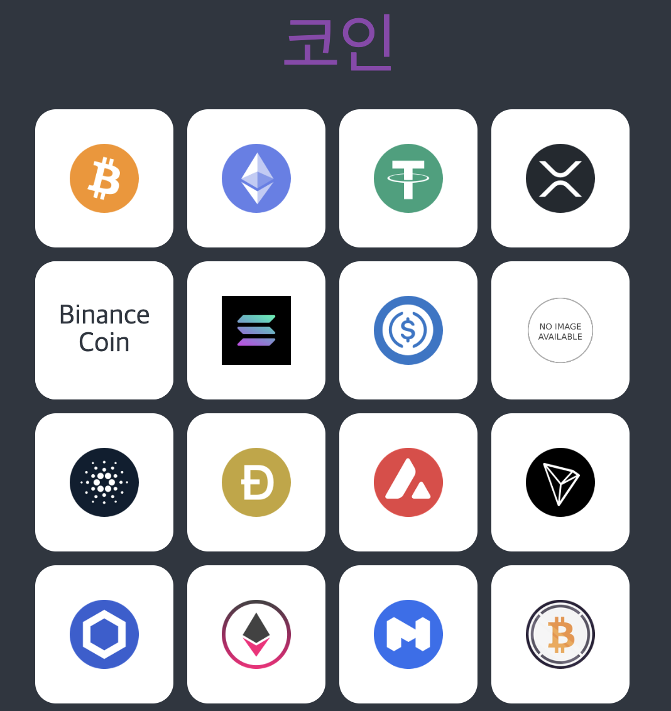
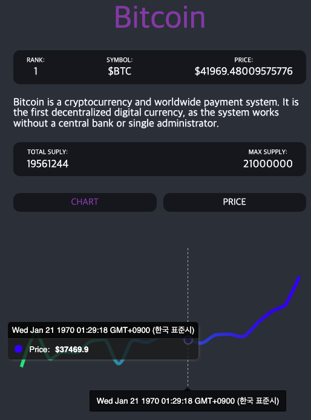

# Coin Dashboard
가상화폐 목록과 각 화폐의 자세한 정보를 대쉬보드로 보여주는 프로젝트  

# Requirement
- node >= v16.x

# Used
- [Styled-Component](https://styled-components.com/)
- [Google Font](https://fonts.google.com/) (Source Sans)
- [Reset CSS](https://meyerweb.com/eric/tools/css/reset/)
- [React-Router-Dom == 5.3.0](https://v5.reactrouter.com/)
- [React-Query](https://tanstack.com/query/v3/)
- [APEXCHARTS](https://apexcharts.com/)
- [React-Helmet](https://github.com/nfl/react-helmet#readme)

# QuickStart
```bash
npm i
npm start
```
# Dashboard Component
## Home

## Detail with Chart
